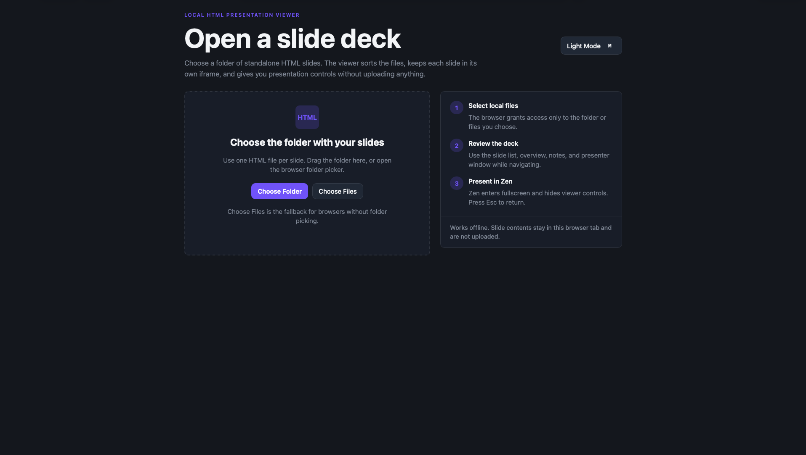
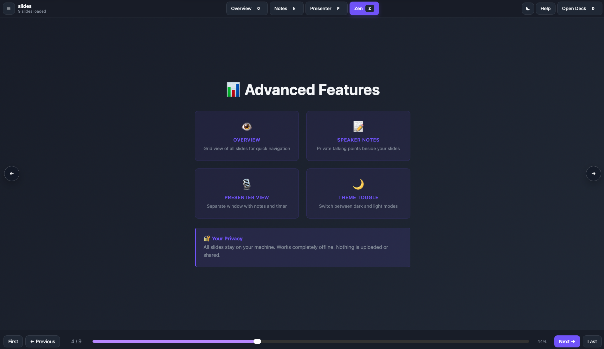
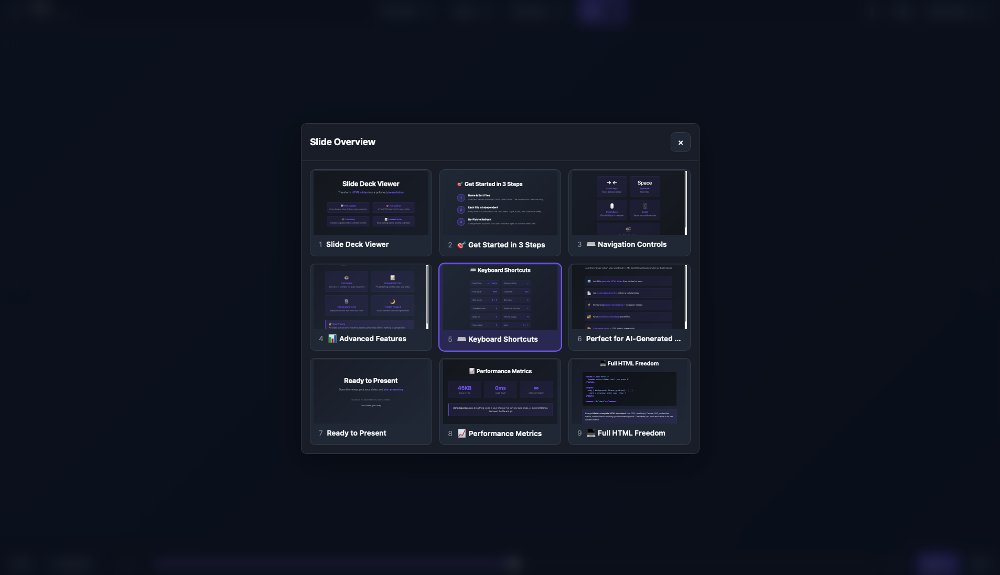
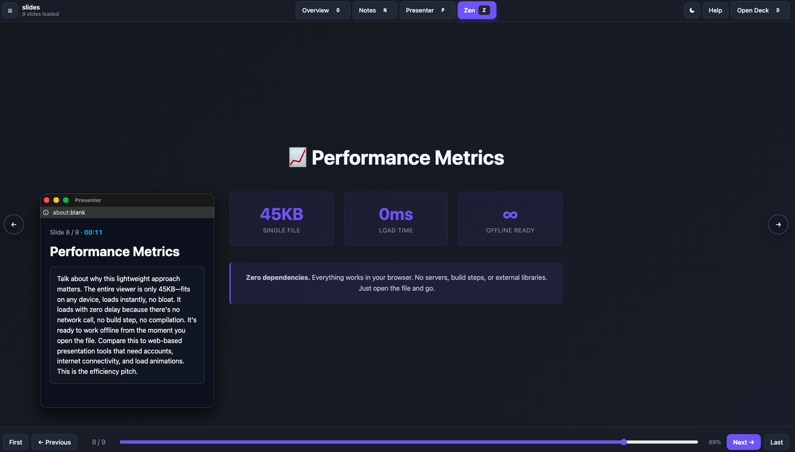

# HTML Deck Studio

A local-first system for creating, maintaining, and presenting standalone HTML slide decks.

HTML Deck Studio has two connected parts:

1. **Local HTML deck viewer**
   Open `100-viewer.html`, choose a folder of HTML slides, and present with navigation, speaker notes, overview mode, fullscreen mode, and a presenter window.

2. **AI-friendly deck generation framework**
   Use `300-templates/` with an AI agent to create and maintain standalone HTML slide decks using reusable layouts, narrative arcs, output rules, deck context, and tokenized themes.

No server. No build step. No runtime dependencies. Your slides stay local.

---

## See It In Action






---

## Why This Exists

Most presentation tools make you choose between:

- proprietary slide editors,
- cloud-based collaboration platforms,
- static exports such as PDFs,
- or developer-heavy presentation frameworks that need build tools.

HTML Deck Studio takes a different approach:

- slides are plain standalone HTML files;
- the viewer runs locally in the browser;
- AI agents can generate and update decks using documented workflows;
- visual style is controlled through tokens, not scattered CSS;
- generated decks remain portable, editable, and versionable;
- deck context is preserved so future updates do not start from scratch.

---

## Two Ways To Use This Repo

### 1. Present an existing HTML deck

Use this when you already have a folder of `.html` slide files.

1. Open `100-viewer.html` in a modern browser.
2. Click **Choose Folder** or **Choose Files**.
3. Select your slide files.
4. Present using buttons, keyboard shortcuts, speaker notes, overview mode, or presenter mode.

### 2. Generate or maintain a deck with AI

Use this when you want an AI agent to create or update a deck.

1. Give the AI agent this repo and your source material.
2. Start with `300-templates/010-overview.md`.
3. Follow `300-templates/130-workflows/010-ai-workflow.md`.
4. Generate standalone slides into `500-output/<deck-name>/`.
5. Include `deck-context.md` beside the slides.
6. Open the generated deck with `100-viewer.html`.

---

## Core Concepts

### Standalone HTML slides

Each slide is a complete HTML document.

A slide should usually include:

- `<!DOCTYPE html>`;
- `<html lang="...">`;
- charset and viewport metadata;
- a meaningful `<title>`;
- inline token definitions;
- inline CSS;
- slide markup;
- optional `<aside class="notes">`.

Slides should not require a server, build step, package manager, CDN, or shared CSS file by default.

### Local viewer

`100-viewer.html` is the runtime viewer.

It:

- opens directly in the browser;
- loads local `.html` / `.htm` slide files;
- keeps slides isolated in iframes;
- supports navigation, speaker notes, overview, fullscreen, and presenter mode;
- stores only lightweight local preferences such as viewer theme and last slide number.

The viewer is intentionally theme-agnostic. It does not need to know whether slides use default light tokens, default dark tokens, or a custom token pack.

### AI generation framework

`300-templates/` is the authoring and generation framework.

It gives an AI agent or human maintainer:

- a canonical standalone slide scaffold;
- a token contract;
- default light and dark token packs;
- custom theme intake guidance;
- layout patterns;
- deck arcs;
- output rules;
- maintenance context rules.

### Tokenized themes

Slides use a token-based visual system.

The framework includes two default complete token packs:

1. **Light default**
   Use for normal light-background decks.

2. **Dark default**
   Use for dark-background or high-contrast decks.

A deck can also use a **custom token pack**.

Custom token packs can be inspired by:

- company or brand references;
- screenshots or visual examples;
- URLs or online style references;
- existing slides or decks;
- user-provided hex values;
- mood words such as "mild", "premium", "bright", or "professional";
- industry, audience, or event context.

The rule is simple:

> External inspiration is allowed. Direct external styling is not.
> All visual inspiration must be converted into the canonical token contract before slide generation.

That means colours from a company reference, screenshot, URL, mood description, or hex input should be mapped into tokens such as:

- `--surface-0`
- `--surface-1`
- `--surface-2`
- `--text-primary`
- `--text-secondary`
- `--border`
- `--brand-primary`
- `--brand-secondary`
- `--success`
- `--warning`
- `--danger`
- `--info`
- `--chart-1` to `--chart-6`

Generated slides should consume those tokens rather than using random hardcoded colours across components.

By default, token values and CSS are embedded inline in each standalone slide. This keeps slides portable and compatible with the local viewer.

### Deck context sidecar

Every generated deck should usually include a `deck-context.md` file.

This file records:

- why the deck was created;
- who the audience is;
- what source material was used;
- which deck arc was chosen;
- which theme path was used;
- whether the deck uses default or custom tokens;
- what visual inspiration shaped the theme;
- what assumptions were made;
- what changed in later revisions.

This makes future AI-assisted maintenance much easier.

---

## Repository Map

```text
.
├── 100-viewer.html
├── 200-demos/
├── 300-templates/
│   ├── 010-overview.md
│   ├── 020-system-guide.md
│   ├── 100-basic.html
│   ├── 110-systems/
│   │   ├── 010-token-reference.md
│   │   ├── 020-theme-intake-and-tokenization.md
│   │   ├── 100-light-default.html
│   │   └── 110-dark-default.html
│   ├── 120-layouts/
│   │   └── 010-layout-catalog.md
│   └── 130-workflows/
│       ├── 010-ai-workflow.md
│       ├── 020-output-contract.md
│       ├── 030-deck-arcs.md
│       └── 040-maintenance-context.md
├── 400-assets/
├── AGENTS.md
└── README.md
```

### Key files

- `100-viewer.html`
  The local single-file presentation viewer.

- `300-templates/010-overview.md`
  Starting point for the slide generation framework.

- `300-templates/020-system-guide.md`
  Main guide for how the token, layout, workflow, and slide systems fit together.

- `300-templates/100-basic.html`
  Canonical standalone slide scaffold.

- `300-templates/110-systems/010-token-reference.md`
  Canonical token contract.

- `300-templates/110-systems/020-theme-intake-and-tokenization.md`
  Guide for converting brand, screenshot, URL, mood, and hex inspiration into tokens.

- `300-templates/110-systems/100-light-default.html`
  Default complete light token pack.

- `300-templates/110-systems/110-dark-default.html`
  Default complete dark token pack.

- `300-templates/120-layouts/010-layout-catalog.md`
  Structural layout patterns for generated slides.

- `300-templates/130-workflows/010-ai-workflow.md`
  End-to-end AI deck creation and maintenance workflow.

- `300-templates/130-workflows/020-output-contract.md`
  Output structure, file naming, standalone slide, and theme rules.

- `300-templates/130-workflows/030-deck-arcs.md`
  Reusable narrative arcs for common presentation types.

- `300-templates/130-workflows/040-maintenance-context.md`
  `deck-context.md` sidecar guidance.

- `AGENTS.md`
  Development guardrails for future changes.

---

## Quick Start

### Present a deck

1. Open `100-viewer.html`.
2. Click **Choose Folder**.
3. Select a folder containing `.html` slides.
4. Use arrow keys, buttons, or the slide list to navigate.
5. Press `N` for speaker notes.
6. Press `P` for presenter mode.
7. Press `Z` or `F` for fullscreen/zen mode.

If folder picking is not available in your browser, use **Choose Files** instead.

### Generate a deck with AI

Ask an AI agent to use the framework like this:

```text
Use this repo to create a standalone HTML slide deck.

Start with:
- 300-templates/010-overview.md
- 300-templates/020-system-guide.md
- 300-templates/130-workflows/010-ai-workflow.md
- 300-templates/130-workflows/020-output-contract.md

Generate the deck into:
500-output/<deck-name>/

Each slide must be standalone HTML with inline token values and CSS.
Also create deck-context.md.
```

If you want custom visual styling, include instructions such as:

```text
Use a professional olive green and black visual direction.
Convert the style into the canonical token contract.
Keep every slide standalone.
Document the theme source and token strategy in deck-context.md.
```

---

## Generated Deck Output

Generated decks belong in `500-output/`.

Recommended structure:

```text
500-output/
└── my-deck-name/
    ├── slide01.html
    ├── slide02.html
    ├── slide03.html
    └── deck-context.md
```

Rules:

- use one subfolder per deck;
- use zero-padded slide names such as `slide01.html`;
- keep slide numbering contiguous;
- keep each slide standalone;
- embed token values and CSS inline by default;
- do not create a shared CSS dependency unless explicitly requested;
- include `deck-context.md` for future maintenance.

---

## Minimal Slide Example

```html
<!DOCTYPE html>
<html lang="en">
  <head>
    <meta charset="utf-8" />
    <meta
      name="viewport"
      content="width=device-width, initial-scale=1" />
    <title>Project Update</title>
    <style>
      body {
        margin: 0;
        height: 100vh;
        display: grid;
        place-items: center;
        font-family: system-ui, sans-serif;
      }

      main {
        max-width: 760px;
      }
    </style>
  </head>
  <body>
    <main>
      <h1>Project Update</h1>
      <p>What changed, what shipped, and what comes next.</p>
    </main>

    <aside class="notes">
      Mention the customer feedback before moving to the roadmap.
    </aside>
  </body>
</html>
```

The viewer uses:

- `<title>` for the slide list label;
- the first heading or filename as fallback;
- `<aside class="notes">` for speaker notes.

---

## Viewer Features

### Local file loading

Choose a folder or individual slide files directly from the browser. No config file is needed.

### Natural slide sorting

Slides are sorted naturally, so `slide02.html` appears before `slide10.html`.

### Navigation

Navigate with:

- toolbar buttons;
- arrow keys;
- spacebar;
- Home / End;
- slide list;
- overview grid;
- touch swipe on supported devices.

### Slide sidebar

Open the slide list to jump directly to any slide.

### Overview grid

Press `O` to see all slides at once and jump to a selected slide.

### Speaker notes

Add notes to any slide:

```html
<aside class="notes">Key talking points only you see.</aside>
```

Press `N` to show notes in a docked sidebar.

### Presenter window

Press `P` to open a separate presenter window with:

- current slide title;
- speaker notes;
- timer;
- slide count.

### Zen fullscreen

Press `Z` or `F` to enter a clean presentation mode.

### Viewer theme toggle

Press `M` to switch the viewer chrome between dark and light mode.

This only changes the viewer interface. It does not change slide iframe contents.

---

## Keyboard Shortcuts

| Action              | Keys           |
| ------------------- | -------------- |
| Next slide          | `→` or `Space` |
| Previous slide      | `←`            |
| First slide         | `Home`         |
| Last slide          | `End`          |
| Zen fullscreen      | `Z` or `F`     |
| Overview grid       | `O`            |
| Speaker notes       | `N`            |
| Presenter window    | `P`            |
| Slide list          | `L`            |
| Viewer theme toggle | `M`            |
| Open deck           | `D`            |
| Help                | `H` or `?`     |
| Close / Exit        | `Esc`          |

---

## Browser Support

| Browser | Status                                         |
| ------- | ---------------------------------------------- |
| Chrome  | Full support                                   |
| Edge    | Full support                                   |
| Safari  | Full support                                   |
| Brave   | Full support                                   |
| Firefox | Use **Choose Files** instead of folder picking |

The viewer uses browser-native file APIs. Folder picking support varies by browser. If folder picking does not work, use **Choose Files** to select individual slides.

---

## Privacy and Offline Model

HTML Deck Studio is local-first.

- Slides stay on your machine.
- The viewer does not upload selected slide files.
- The viewer works without a server.
- The viewer does not require a build step.
- The viewer does not require runtime dependencies.
- Lightweight viewer preferences are stored in browser storage.
- Browser access to selected files is temporary and user-granted.

---

## What This Is

HTML Deck Studio is:

- a local HTML slide deck viewer;
- an AI-friendly slide generation framework;
- a token-based visual system for standalone HTML decks;
- a way to create custom-branded decks from controlled visual inspiration;
- a portable workflow for decks that should remain editable as plain files;
- useful for users who want local control, versionable output, and no presentation server.

---

## What This Is Not

HTML Deck Studio is not:

- a PowerPoint-compatible file editor;
- a visual drag-and-drop slide editor;
- a collaborative cloud presentation platform;
- a markdown-to-slides pipeline;
- a PDF exporter;
- a hosted web app;
- a runtime theme generator for already-loaded slides;
- a tool that uploads your slide content.

---

## How This Compares

Use HTML Deck Studio when you want local, editable, AI-generatable HTML decks with code-level control.

It is not intended to replace PowerPoint, Keynote, or Google Slides for users who need GUI editing, live collaboration, or native office-format workflows.

It is also not intended to replace developer-heavy presentation frameworks when you specifically want routing, plugins, build pipelines, or web deployment.

HTML Deck Studio sits in a narrower space:

```text
plain HTML slides
+ local presentation viewer
+ AI-assisted generation workflow
+ tokenized visual consistency
+ offline-friendly operation
```

---

## Development and Maintenance

See `AGENTS.md` for development guardrails.

Core principles:

- keep `100-viewer.html` dependency-free;
- preserve direct browser usage;
- keep generated slides standalone by default;
- keep viewer runtime behavior separate from the authoring framework;
- update `README.md` when user-facing behavior changes;
- update `deck-context.md` when generated decks are materially changed.

Before changing viewer behavior, test with:

- at least two `.html` slides;
- one slide containing `<aside class="notes">`;
- both dark and light viewer chrome;
- folder selection and file selection where possible.

Before changing template or generation behavior, check:

- token names follow the canonical contract;
- custom inspiration is converted into tokens;
- generated slides remain standalone;
- output follows the output contract;
- `deck-context.md` records narrative and theme decisions.
