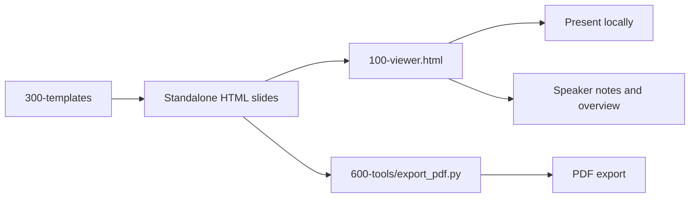
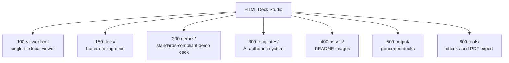

# HTML Deck Studio

HTML Deck Studio is a local-first system for presenting, generating, maintaining, and exporting standalone HTML slide
decks.

It is built around a simple idea: a deck can be a folder of plain HTML files. Open the viewer, choose the folder, present
the deck, and export it to PDF when you need a shareable artifact.

## What You Can Do

- Open a folder of standalone `.html` slides in `100-viewer.html`.
- Present with slide navigation, overview, speaker notes, presenter window, and fullscreen mode.
- Export a deck to PDF with the optional local Python/Playwright toolchain.
- Generate and maintain AI-created decks using the tokenized authoring system in `300-templates/`.
- Keep slide files local, portable, editable, and versionable.



## Quick Start

### Present a Deck

1. Open `100-viewer.html` in a modern browser.
2. Click **Choose Folder**.
3. Select a folder containing `slide01.html`, `slide02.html`, and so on.
4. Present with arrow keys, toolbar buttons, overview mode, notes, or fullscreen.

If your browser does not support folder picking, use **Choose Files** and select the slide files. If the deck uses local
assets such as `assets/chart.png`, choose the full folder so those assets are included.

### Export a Deck to PDF

PDF export is a first-class feature, but it is intentionally separate from normal viewer use so the viewer remains
dependency-free.

```bash
python3 -m venv .venv
.venv/bin/python -m pip install -r 600-tools/requirements/pdf.txt
.venv/bin/python -m playwright install chromium
.venv/bin/python 600-tools/export_pdf.py 200-demos --out demo.pdf
```

The exporter renders each slide in Chromium and merges the pages into one full-bleed 16:9 PDF.

### Generate a Deck With AI

Use the authoring system in `300-templates/` when asking an AI coding agent to create or update a deck.

Recommended starting points:

- `300-templates/010-overview.md`
- `300-templates/020-system-guide.md`
- `300-templates/130-workflows/010-ai-workflow.md`
- `300-templates/130-workflows/020-output-contract.md`

Generated decks should usually go in `500-output/<deck-name>/` with standalone slide files and a `deck-context.md`.

## Security and Privacy

The viewer is designed for local-first use.

- Selected files are read by the browser only after the user chooses them.
- Slide and asset files are represented with temporary object URLs.
- Old object URLs are revoked when a new deck is loaded.
- Slides render in sandboxed iframes so slide code is separated from the viewer chrome.
- The viewer does not upload selected slide files.

Important boundary: arbitrary HTML slides can still contain remote references. Use the validation tools and avoid remote
runtime assets when you need fully offline or no-network behavior.

Read more in `150-docs/120-security-model.md`.

## Repository Map



Core folders:

- `100-viewer.html` - local presentation viewer.
- `150-docs/` - user guide, PDF export guide, security model, and development/testing guide.
- `200-demos/` - reference demo deck built to the current slide contract.
- `300-templates/` - AI authoring system, token references, layout catalog, and output rules.
- `500-output/` - recommended location for generated decks.
- `600-tools/` - validation, smoke tests, CI helpers, and PDF export tooling.

## Documentation

Start with `150-docs/README.md`.

- `150-docs/100-user-guide.md` - how to open, present, and navigate decks.
- `150-docs/110-pdf-export.md` - setup, export commands, options, and troubleshooting.
- `150-docs/120-security-model.md` - privacy boundaries and iframe/file handling.
- `150-docs/130-development-and-tests.md` - checks, CI, and maintenance rules.

The `300-templates/` folder is deeper reference material for AI-assisted deck creation.

## Development Checks

Run the standard checks before considering viewer, demo, template, or tooling changes done:

```bash
python3 600-tools/run_checks.py
```

Run the browser smoke test when the optional development dependencies are installed:

```bash
python3 -m venv .venv
.venv/bin/python -m pip install -r 600-tools/requirements/dev.txt
.venv/bin/python -m playwright install chromium
.venv/bin/python 600-tools/run_checks.py --browser
```

The GitHub Actions workflow in `.github/workflows/ci.yml` runs the same browser-enabled check suite on push and pull
request.

## Design Principles

- Normal viewer use must stay dependency-free.
- Generated slides should be standalone HTML by default.
- Visual style should be tokenized, not scattered across components.
- PDF export can use an optional local toolchain because accurate HTML/CSS rendering needs a browser engine.
- Tests and docs should change with features, not after features.
